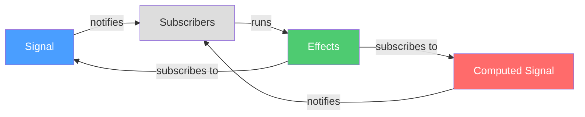
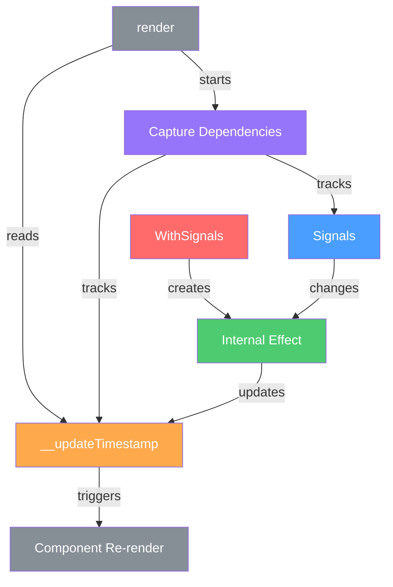

# LWC Signals Architecture

This document explains the internal architecture and concepts of LWC Signals.

## Signals Flow

A simple reactive system:

- **Signals & Computed**: Notify subscribers when values change
- **Effects**: Subscribe to signals and run when changes occur

## LWC Integration

WithSignals makes components reactive by tracking dependencies during render:

- **WithSignals**: Uses an internal effect to track signal dependencies
- **Render Process**: 
  - Captures which signals are used
  - Reads internal __updateTimestamp property
  - __updateTimestamp becomes a dependency
- **Updates**: Changes to signals trigger timestamp update, causing re-render